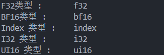

## build llvm-project
```bash
cd llvm-project
mkdir build
cd build

cmake -G Ninja ../llvm \
  -DCMAKE_INSTALL_PREFIX=/home/cyj/studyspace/llm001/ai-compiler/mlir/mlir-learn/install \
  -DLLVM_ENABLE_PROJECTS=mlir \
  -DLLVM_BUILD_EXAMPLES=ON \
  -DLLVM_TARGETS_TO_BUILD="Native;NVPTX;AMDGPU" \
  -DCMAKE_BUILD_TYPE=Release \
  -DLLVM_ENABLE_ASSERTIONS=ON

ninja install
```

## build mlir-toy
```bash
mkdir build
cd build
cmake .. -GNinja -DCMAKE_INSTALL_PREFIX=/home/cyj/studyspace/llm001/ai-compiler/mlir/mlir-learn/install
```

## MLIR 内建Type
### 基本标量类型
- iN：整数类型，N 表示位宽（如 i1、i8、i32、i64）。i1 通常用于表示布尔值。
- fN：浮点类型，N 表示位宽（如 f16、f32、f64），遵循 IEEE 754 标准。
- index：索引类型，用于表示内存地址或循环索引，位宽与目标架构的指针宽度一致（如 32 位或 64 位）。等价与CPP中的`size_t`

```cpp
// 浮点数，每种位宽和标准定义一个
auto f32 = mlir::Float32Type::get(context);
llvm::outs() << "F32类型 :\t";
f32.dump();

auto bf16 = mlir::BFloat16Type::get(context);
llvm::outs() << "BF16类型 :\t";
bf16.dump();

// Index 类型，机器相关的整数类型
auto index = mlir::IndexType::get(context);
llvm::outs() << "Index 类型 :\t";
index.dump();

// 整数类型, 参数: 位宽&&有无符号
auto i32 = mlir::IntegerType::get(context, 32);
llvm::outs() << "I32 类型 :\t";
i32.dump();
auto ui16 =
    mlir::IntegerType::get(context, 16, mlir::IntegerType::Unsigned);
llvm::outs() << "UI16 类型 :\t";
ui16.dump();
```


### 张量类型
- 静态张量：维度大小固定，如 tensor<4x8xi32> 表示 2 维张量（4 行 8 列，元素类型为 i32）。
- 动态张量：维度大小可变，用 ? 表示，如 tensor<?x?xf32> 表示 2 维动态浮点张量。
- 零维张量：标量的张量包装，如 tensor<i32> 等价于标量 i32（但语义上属于张量范畴）。

```cpp
 // 张量类型,表示的是数据，不会有内存的布局信息。
auto static_tensor = mlir::RankedTensorType::get({1, 2, 3}, f32);
llvm::outs() << "静态F32 张量类型 :\t";
static_tensor.dump();
// 动态张量
auto dynamic_tensor =
    mlir::RankedTensorType::get({mlir::ShapedType::kDynamic, 2, 3}, f32);
llvm::outs() << "动态F32 张量类型 :\t";
dynamic_tensor.dump();
```


### memref 类型
memref类型是用于描述内存中多维数组的核心类型，它不仅包含数组的逻辑形状，还明确指定了内存布局（如元素在内存中的排列方式）和地址空间，是连接高层抽象（如张量计算）与底层内存操作的关键桥梁。其核心作用包括：
- 描述多维数组的逻辑形状（如 2×3 的矩阵）
- 定义元素在内存中的物理布局（如步长、偏移量）
- 指定数据所在的地址空间（如全局内存、局部内存、设备内存）
- 支持底层代码生成（如 LLVM IR）时的内存访问优化。

`memref` 类型的完整语法为： `memref<ShapexElementType, Layout, AddressSpace>`
- Shape
    与张量类型的形状一致，描述数组的维度信息，由静态维度（整数）和动态维度（?）组成
- ElementType
    数组中单个元素的类型，可与张量的元素类型相同, 支持基本类型（如 i32、f64、index），复合类型（如 vector<4xi8>、struct<(i16, f32)>）
- Layout
    **strides（步长）**：一个整数列表，长度与数组维度相同，描述每个维度上 “跨一个元素” 需要跳过的内存单元数（以元素大小为单位）.
    **Offset（偏移量）**：整数，表示数组第一个元素在内存中的起始位置相对于 “基地址” 的偏移（以元素大小为单位）
    **affine_map 布局**
    通过仿射映射（Affine Map）自定义布局，支持更灵活的内存映射关系（如列优先、块划分等）。
    示例：memref<2x3xi32, affine_map<(i,j) -> (j*2 + i)>, 0> 定义了列优先的布局（元素 [i,j] 位置为 j×2 + i）。
- AddressSpace（地址空间）
    一个非负整数，用于区分不同的内存区域（如主机内存、GPU 全局内存、寄存器文件等），默认地址空间为 0。

```cpp
// Memref类型：表示内存
auto basic_memref = mlir::MemRefType::get({1, 2, 3}, f32);
llvm::outs() << "静态F32 内存类型 :\t";
basic_memref.dump();
// 带有布局信息的内存

auto stride_layout_memref = mlir::MemRefType::get(
    {1, 2, 3}, f32, mlir::StridedLayoutAttr::get(context, 1, {6, 3, 1}));
llvm::outs() << "连续附带布局信息的 F32 内存类型 :\t";
stride_layout_memref.dump();
// 使用affine 表示布局信息的内存
auto affine_memref = mlir::MemRefType::get(
    {1, 2, 3}, f32,
    mlir::StridedLayoutAttr::get(context, 1, {6, 3, 1}).getAffineMap());
llvm::outs() << "连续附带 affine 布局信息的 F32 内存类型 :\t";
affine_memref.dump();
// 动态连续附带 affine 布局信息的内存
auto dynamic_affine_memref = mlir::MemRefType::get(
    {mlir::ShapedType::kDynamic, 2, 3}, f32,
    mlir::StridedLayoutAttr::get(context, 1,
                                    {mlir::ShapedType::kDynamic, 3, 1})
        .getAffineMap());
llvm::outs() << "连续附带 affine 布局信息的动态 F32 内存类型 :\t";
dynamic_affine_memref.dump();
// 具有内存层级信息的内存
auto L1_memref = mlir::MemRefType::get(
    {mlir::ShapedType::kDynamic, 2, 3}, f32,
    mlir::StridedLayoutAttr::get(context, 1,
                                    {mlir::ShapedType::kDynamic, 3, 1})
        .getAffineMap(),
    1);
llvm::outs() << "处于L1层级的 F32 内存类型 :\t";
L1_memref.dump();
// gpu 私有内存层级的内存
context->getOrLoadDialect<mlir::gpu::GPUDialect>();
auto gpu_memref = mlir::MemRefType::get(
    {mlir::ShapedType::kDynamic, 2, 3}, f32,
    mlir::StridedLayoutAttr::get(context, 1,
                                    {mlir::ShapedType::kDynamic, 3, 1})
        .getAffineMap(),
    mlir::gpu::AddressSpaceAttr::get(context,
                                        mlir::gpu::AddressSpace::Private));
llvm::outs()
    << "连续附带 affine 布局信息的动态 F32 Gpu Private内存类型 :\t";
gpu_memref.dump();
```


###  向量类型
表示固定大小的一维或多维向量，通常用于 SIMD（单指令多数据）优化
格式：array<NxT>，N 为长度，T 为元素类型。
示例：array<5xi32> 表示含 5 个 i32 元素的数组。

```cpp
// 向量类型,定长的一段内存
auto vector_type = mlir::VectorType::get(3, f32);
llvm::outs() << "F32 1D向量类型 :\t";
vector_type.dump();

auto vector_2D_type = mlir::VectorType::get({3, 3}, f32);
llvm::outs() << "F32 2D向量类型 :\t";
vector_2D_type.dump();
```
