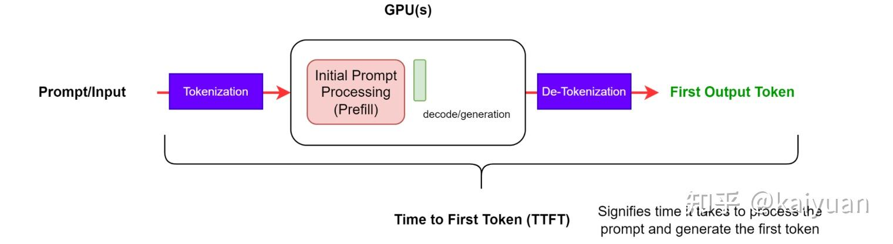
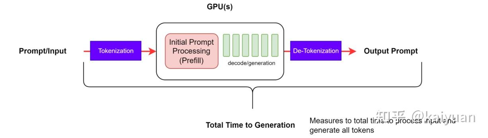
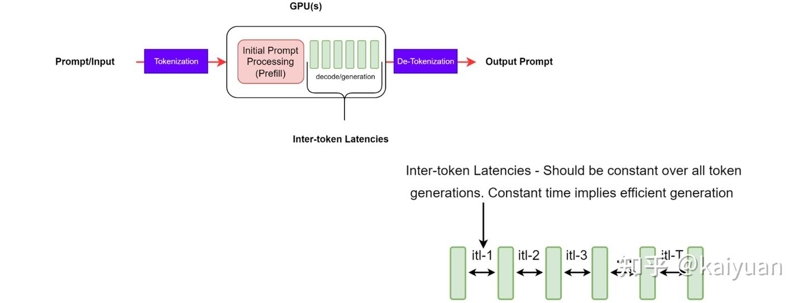
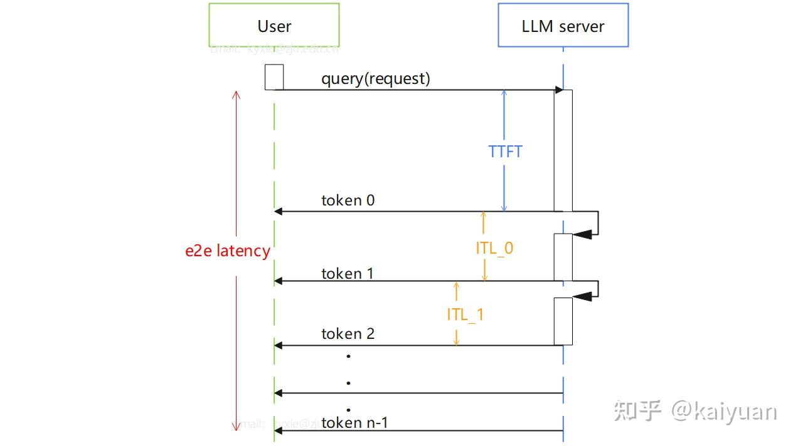
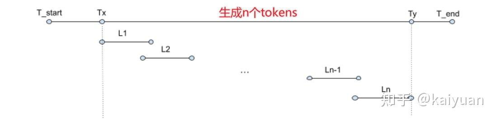

- **TTFT**(Time To First Token): 首token生成的时间，用于衡量prefill性能的指标。
  
- **E2EL**(End To End Latency): 端到端请求时延。从输入提示词到生成所有结果并返回结束。
  
- **ITL**(Inter Token Latency): 解码（decode）阶段每个token的生成时间，一般公式：$ITL = \frac{E2EL - TTFT}{n - 1}$
  
- **TBT**(Time Between Tokens): 两个token之间的间隔时间，一般指某个token的生成时间。
  公式：$TBT_i = latency_i - latency_{i-1}$
- **TPOT**(Time Per Output Token): 所有tokens生成的平均时间，包括首token
  公式：$TPOT = \frac{E2EL}{n}$
  在一些应用场景下（比如vLLM中），ITL采用了TBT的计算方式。TPOT采用了ITL的计算方式。
- **QPS**(Queries Per Second): 每秒处理的请求数量。
  公式：$QPS = \frac{T}{\sum^{T}_{request=0} latency(i)}$
  
- **TPS**(Tokens Per Second): 每秒吞吐量的总输出 token 数。
  公式：$TPS = \frac{n_{tokens}}{T_y - T_x}$, 单位：token/s
  
- **QPM**(Queries Per Minute): 每分钟处理的请求的数量。
- **TP90**(Top Percentile): 至少有90%或者99%的请求满足该条件，类似指标还有TP50、TP99。
- **RPS(Requests per Second)**: 每秒请求数，用于控制测试时的请求注入速率，也是吞吐量测试的重要参考指标，单位req/s。
- **Ramp Up**: 爬坡测试，在修改RPS来测试服务性能。
- **SLO(Service Level Objective)**：服务质量目标,是确保为客户提供优质服务的关键。例如过去一段时间内请求是否都满足TP99，TPS=20tok/s。
- **MFU(Model Flops Utilization)**：是衡量模型对GPU算力资源使用效率的一个指标。
