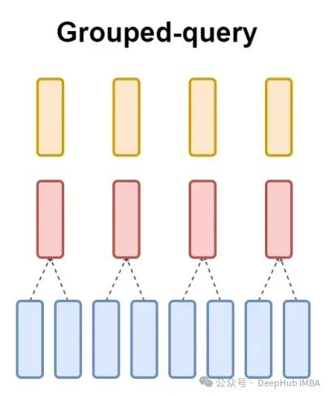

GQA，全称 Grouped Query Attention（分组查询注意力）

# 1. 从 MHA 到 GQA 的演进
## 1.1 多头注意力 (MHA)
原始的 多头注意力 (Multi-Head Attention) 给每个注意力头都分配了独立的 Q、K、V 投影。假设总共有 H 个头，则：

输入会分别通过 H 组 $W_Q$、$W_K$、$W_V$ 矩阵。

总共 3 × H 组不同的权重。

这种设计的表达能力最强，但 计算量和显存占用 也最大。尤其在长序列生成时，每个头都要维护一份 Key 和 Value 的缓存，显存开销随序列长度和头数线性增长。

## 1.2 多查询注意力 (MQA)
为了缓解显存压力，多查询注意力 (Multi-Query Attention) 提出：所有头共享同一组 Key 和 Value，只有 Query 保持多头。

所有头使用相同的 $W_K$、$W_V$，仅 $W_Q$ 保持多头。

K、V 缓存减少为原来的 1/H，大幅降低了推理显存。

缺点：表达能力受损，模型质量可能下降，某些任务甚至需要额外训练技巧来弥补。

1.3 分组查询注意力 (GQA)
GQA 是 MHA 和 MQA 的折中方案。它将所有 Query 头分成 G 个组，每个组内的 Query 头共享同一对 Key、Value 头。

假设总头数 H = 32，组数 G = 8，则每个组包含 32/8 = 4 个 Query 头。

这意味着总共有 G = 8 个 Key、Value 头（而不是 MHA 的 32 个，也不是 MQA 的 1 个）。

这样，KV 缓存降为 MHA 的 G/H 倍，而模型质量只微幅下降，几乎不影响性能。实验证明，GQA 在质量和效率之间取得了极佳的平衡。

# 2. 数学定义与计算流程
设：

Query 头数：`N_q`

Key/Value 头数：`N_kv`，且 `N_kv < N_q`

组大小：`G = N_q // N_kv`（必须整除）

则 GQA 的计算步骤如下：

线性投影
输入 X 分别投影：

`Q = X @ W_Q → (batch, seq_len, N_q × d_head)`

`K = X @ W_K → (batch, seq_len, N_kv × d_head)`

`V = X @ W_V → (batch, seq_len, N_kv × d_head)`

变形
将 Q 变形为 `(batch, N_q, seq_len, d_head)`，K、V 变形为 `(batch, N_kv, seq_len, d_head)`。

扩展 K、V（复制分组）
将每个 KV 头复制 G 份，使其与 Query 头数对齐：

K：`(batch, N_kv, seq_len, d_head)` → 扩充为 `(batch, N_q, seq_len, d_head)`

V 同理。

这样处理后，就能像标准 MHA 一样计算注意力了。

注意力计算
对于第 i 个头（0 ≤ i < N_q）：
`Attention(Q_i, K_g(i), V_g(i)) = softmax( Q_i @ K_g(i)^T / √d_head ) @ V_g(i)`
其中 `g(i) = i // G` 是其所属的 KV 组。

拼接与输出投影
所有头的输出拼接后，经 W_O 投影回模型维度。