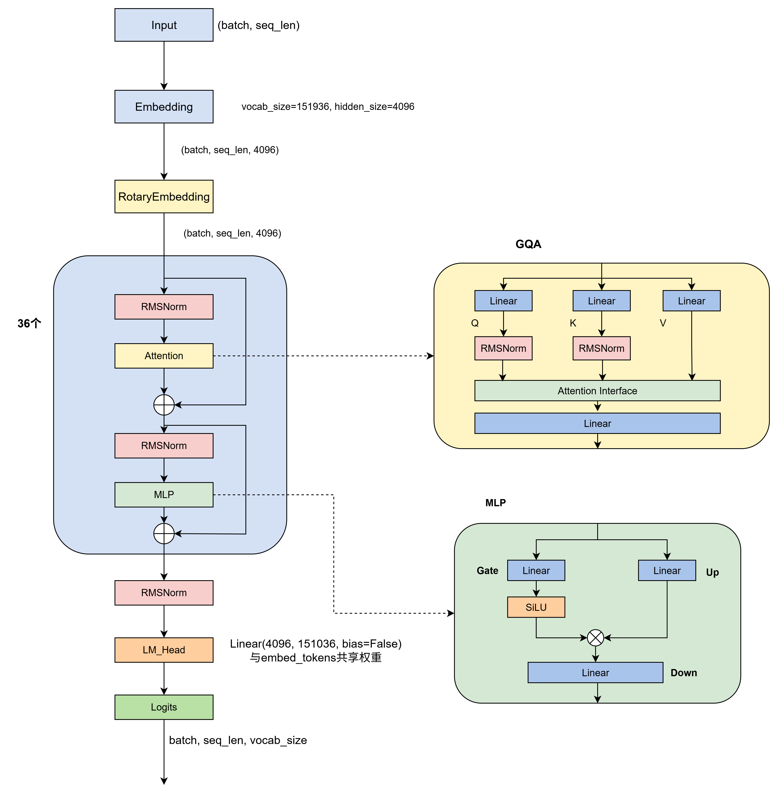
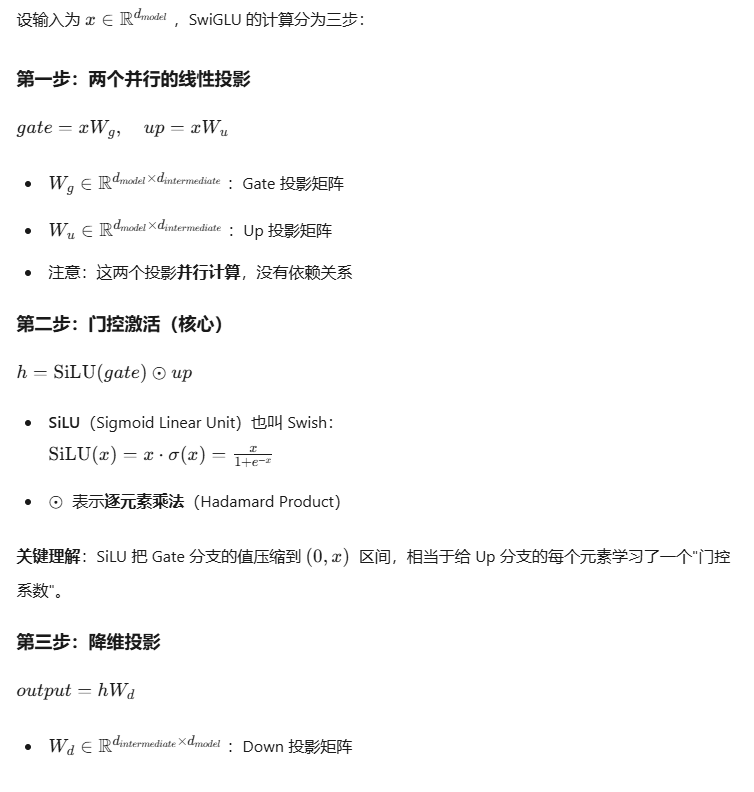

# Qwen3-Dense 模型架构如下图

Qwen3 的 Dense 模型家族，通过精细地调整层数、隐藏维度和注意力头数等参数，形成了一条从 0.6B 到 32B 的完整配置线。图中hidden_size=4096只是示例。

## MLP 模块理解
**标准 FFN（原始 Transformer）**
原始论文使用的是一个简单的两层全连接网络：
$FFN(x)=max(0,xW_1+b_1)W_2+b_2$
- 输入维度：$d_{model}$（如 4096）
- 隐藏层维度：$4×{d_model}$（如 16384）
- 激活函数：ReLU，后来演变为 GeLU

**Qwen3 使用的 SwiGLU FFN**
Qwen3 采用的是 SwiGLU（Swish-Gated Linear Unit），这是目前大模型（LLaMA、Qwen、Mixtral 等）的主流选择。以下是其计算步骤：

**SwiGLU 的优势**
- 门控机制：不是对所有隐藏单元一视同仁，而是根据输入动态决定哪些信息该通过、哪些该过滤
- SiLU 平滑：比 ReLU 更平滑，比 GeLU 在负区间有更强的梯度
- 参数量补偿：虽然多了 $W_g$矩阵，但 $d_{intermediate}$通常设为$\frac{2}{3} × 4d_{model}$ ，总参数量与标准 FFN 接近。