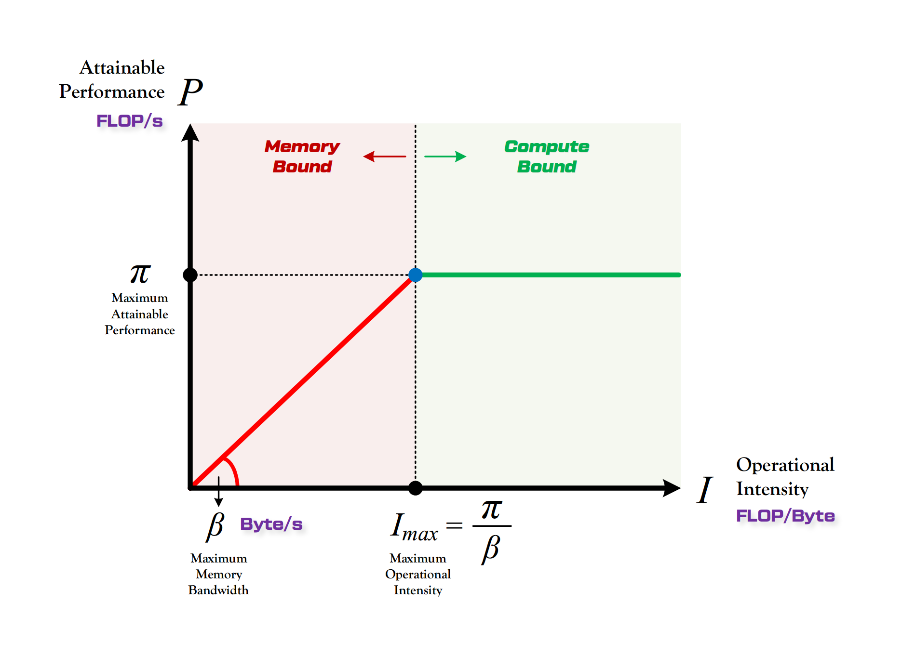

**Roofline Model 提出了使用 Operational Intensity（计算强度）进行定量分析的方法，并给出了模型在计算平台上所能达到理论计算性能上限公式。**

## 计算平台的性能指标

- **算力$\pi$**: 计算平台的**性能上限**，指的是一个计算平台倾尽全力每秒钟能完成的浮点运算数。单位是`FLOPS`或者`FLOP/s`。即：$\pi = Maximum \ \  FLOPs \ \  Per \ \  Second$

- **带宽$\beta$**: 计算平台的**带宽上限**，指的是一个计算平台倾尽全力每秒能完成的内存交换量。单位是`Byte/s`, 即：$\beta = Maximum \ \  Memory \ \  Access \ \ Per \ \  Second$

- **计算强度上限$I_{max}$**: 两个指标相除即可得到计算平台的计算强度上限。它描述的是在这个计算平台上，单位内存交换最多用来进行多少次计算。单位是`FLOPS/Byte`。即：$${I_{max} = \pi / \beta}$

## 计算量与放存量

- **计算量**: 指的是输入单个样本，模型进行一次完整的前向传播所发生的浮点运算个数，也即模型的时间复杂度。

- **放存量**: 指的是输入单个样本，模型完成一次前向传播过程中所发生的内存交换总量，也即模型的空间复杂度。在理想情况下，模型的访存量就是模型各层权重参数的内存占用与每层所输出的特征图的内存占用之和。

- **模型的计算强度**: 由计算量除以放存量就可以得到模型的计算强度，它表示此模型在计算过程中，每单位内存交换到底用于进行多少次浮点计算。单位是`FLOPS/Byte`。模型计算强度越大，其内存使用效率越高。

- **模型的理论性能**: 模型在计算平台上所能达到的理论计算性能上限。单位是`FLOPS`或者`FLOP/s`。即：$${I_{max} \times \beta}$

## Roofline Model

Roof-line Model 说的是很简单的一件事：模型在一个计算平台的限制下，到底能达到多快的浮点计算速度。更具体的来说，**Roof-line Model 解决的是“计算量为A且访存量为B的模型在算力为C且带宽为D的计算平台所能达到的理论性能上限E是多少”这个问题**。

所谓“Roof-line”，指的就是由计算平台的算力和带宽上限这两个参数所决定的“屋顶”形态，如下图所示。

- 算力决定“屋顶”的高度（绿色线段）
- 带宽决定“房檐”的斜率（红色线段）
  $$
  P =
  \begin{cases}
  \beta \cdot I, & \text{when } I < I_{max} \quad \text{\textcolor{red}{Memory Bound}} \\
  \pi, & \text{when } I \geq I_{max} \quad \text{\textcolor{green}{Compute Bound}}
  \end{cases}
  $$

### 计算瓶颈区域 Compute-Bound

不管模型的计算强度 $I$ 有多大，它的理论性能 $P$ 最大只能等于计算平台的算力 $\pi$。当模型的计算强度 $I$ 大于计算平台的计算强度上限 $I_{max}$ 时，模型在当前计算平台处于 Compute-Bound 状态，即模型的理论性能 $P$ 受到计算平台算力 $\pi$ 的限制，无法与计算强度 $I$ 成正比。但这其实并不是一件坏事，因为从充分利用计算平台算力的角度上看，此时模型已经 100% 的利用了计算平台的全部算力。可见，计算平台的算力 $\pi$ 越高，模型进入计算瓶颈区域后的理论性能 $P$ 也就越大。

### 带宽瓶颈区域 Memory-Bound

当模型的计算强度 $I$ 小于计算平台的计算强度上限 $I_{max}$ 时，由于此时模型位于“房檐”区间，因此模型理论性能 $P$ 的大小完全由计算平台的带宽上限 $\beta$（房檐的斜率）以及模型自身的计算强度 $I$ 所决定，因此这时候就称模型处于 Memory-Bound 状态。可见，在模型处于带宽瓶颈区间的前提下，计算平台的带宽 $\beta$ 越大（房檐越陡），或者模型的计算强度 $I$ 越大，模型的理论性能 $P$ 可呈线性增长。
